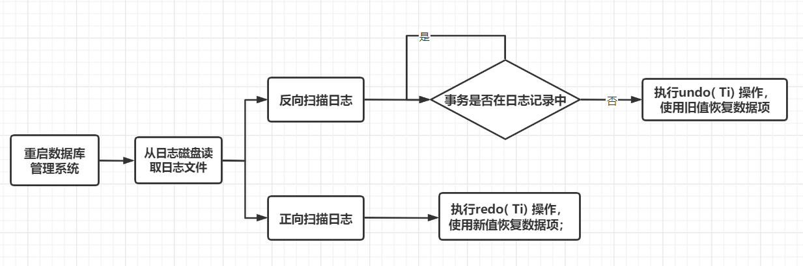
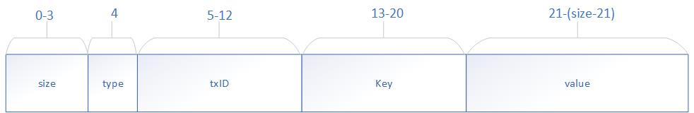

# 斯坦福cs-245 as3 数据库故障与恢复

[TOC]

## 一、项目介绍

​		本项目主要是理解数据库事务的ACID特性，聚焦在一致性和持久性两部分，实现满足数据库的C/D特性的数据库设计。该项目主要源自于斯坦福cs-245，具体可参考

[https://github.com/stanford-futuredata/cs245-as3-public](https://github.com/stanford-futuredata/cs245-as3-public)

## 二、工作内容

### 要做什么？

整体工作需要实现一个支持持久化的事务管理系统

### 怎么做？

#### 第一部分：Implementing Durable Transactions

​		**首先需要在“TransactionManager.java”中实现如下接口：**

- ```java
  //指示新事务的开始。接口将保证txID始终增加（即使在发生碰撞时）
  void start(long txID)
  ```

- ```java
  //返回任何事务为密钥提交的最新值。 
  byte[] read(long txID, long key)
  ```

- ```java
  /*对数据库的写入。请注意，在进行写操作的事务提交之前，read()调用不应看到此类写操作。为了简单起见，在对同一个key进行写入之后，接口不会从txID本身读取该密钥。*/
  void write(long txID, long key, byte[] value)
  ```

- ```java
  //提交事务，并使其写操作对后续读取操作可见。
  void commit(long txID)
  ```

- ```java
  //回滚事务
  void abort(long txID)
  ```

- ```java
  /*每当队列写入变为持久时，存储管理器都会调用此过程。这些调用是按写入密钥的顺序进行的，除非发生崩溃，否则每一次这样的排队写入都会发生一次。*/
  void writePersisted(long key, long persisted_tag, byte[] persisted_value)
  ```

- ```java
  /*初始化和恢复的API，使用StorageManager和LogManager初始化TransactionManager，此时，应该检测StorageManager是否是非一致性，并将其恢复。*/
  void initAndRecover(StorageManager sm, LogManager lm)
  ```

  上面主要实现了一个事务的基本接口，用以保证事务的原子性。

  **除了原子性，项目还要考察持久性**

​		持久性通过调用LogManager和StorageManager类的方法来实现。LogManager和StorageManager能从不同角度保证持久性，注意log只能通过(append)写日志记录(logrecords)。logrecords是一个学生自定义格式的有大小限制(128byte)的byte数组，并且追加的记录也具有原子性，即如果在追加之后仍然有该记录的追加动作，这个动作会被阻塞。

- LogManager

  - ```java
    //返回log尾部的偏移量
    int getLogEndOffset()
    ```

  - ```java
    /*原子性追加和持久化日志记录到log尾部，确保前面的追加已成功才执行本次写入。返回append之前的日志偏移量*/
    int appendLogRecord(byte[] record);
    ```

  - ```java
    /*返回偏移为offset，长度为len的日志记录，超出range会抛出异常*/
    byte[] readLogRecord(int offset, int size)
    ```

  - ```java
    /*持久地将offset存储为当前日志截断偏移量，并截断（删除）日志直至该点。这是原子性的。*/
    void setLogTruncationOffset(int offset)
    ```

  - ```java
    //当前日志截断偏移量
    int getLogTruncationOffset();
    ```

- StorageManager

  - ```java
    /*写不同key时，可能发生持久化的顺序和调用queueWrite顺序不一致的情况；写相同key时，持久化顺序和调用顺序一致。可以认为每个key有一个独立的队列。*/
    void queueWrite(long key, long tag, byte[] value)
    ```

  - ```java
    /*返回系统最后一次故障前的key和value的mapping。首次调用返回空map*/
    HashMap<Long, TaggedValue> readStoredTable()
    ```

#### 第二部分：Truncating the log and Fast Recovery

​		由于如果每次恢复数据库都需要从头开始（或者从尾开始）扫描日志的话太费时，所以这个部分的任务是为了降低恢复成本来截断数据。当key的写入被持久化时，StorageManager会调用writePersisted。需要实现一个方案来追踪哪些提交的写入没有被StorageManager应用并持久化。从这些信息中，需要得出一个日志截断点。并且当出现故障时，从最后一个截断点开始恢复数据库。重点是，应当在数据库恢复时，尽量减少日志的阅读次数。recoveryPerformance测试用于检查日志在操作期间是否被截断，以及恢复数据库对日志的I/O次数。

## 三、实现思路

### 3.1、事务故障的恢复：撤消事务（UNDO）

具体方法：

(1). 反向扫描文件日志（即从最后向前扫描日志文件），查找该事务的更新操作。
(2). 对该事务的更新操作执行逆操作。即将日志记录中“更新前的值” 写入数据库。
插入操作， “更新前的值”为空，则相当于做删除操作
删除操作，“更新后的值”为空，则相当于做插入操作
若是修改操作，则相当于用修改前值代替修改后值
(3). 继续反向扫描日志文件，查找该事务的其他更新操作，并做同样处理。
(4). 如此处理下去，直至读到此事务的开始标记，事务故障恢复就完成了。

### 3.2、系统崩溃故障的恢复

- 发生系统故障时，事务未提交

​		恢复策略：强行撤消（UNDO）所有未完成事务

- 发生系统故障时，事务已提交，但缓冲区中的信息尚未完全写回到磁盘上。

 	   恢复策略：重做（REDO）所有已提交的事务

具体方法：

​		重启数据库管理系统；从日志磁盘读取日志文件；反向扫描日志，也就是从日志文件的结束位置开始后向扫描。当发现一个事务在日志记录中没有 记录时，执行undo( Ti) 操作，使用旧值恢复数据项: 然后从日志文件的开始位置顺向扫描。对日志记录中含有的事务，执行redo( Ti) 操作，使用新值恢复数据项。参考下图：



### 3.3、本项目的故障恢复策略

* 对于类型一的故障，本项目保证了在项目写入日志后才进行持久化，因此不会出现存在在日志中的记录没有持久化的情况，故不考虑；
* 对于类型二的故障，本项目采用 redo log 的方式完成故障恢复，即正向扫描日志记录，使用日志记录中的新值恢复数据。

### 3.4、检查点的选择

​		对于StorageManager的持久化操作，每次持久化都会记录下相应的日志的尾部，作为候选点，从候选点中选出一个最小的作为检查点，这样确保检查点之前的事务相关写入都已经持久化，数据库恢复时就不必要重新扫描了。

## 四、设计方案

### 4.1、日志格式



- 0-3以int形式存日志的长度（包括size字段本身）

- 4存一个byte，代表日志的类型，如下

  | 类型定义 | 数据值 |
  | :------- | :----- |
  | 事务开始 | 0      |
  | 写事务   | 1      |
  | 事务提交 | 2      |
  | 事务回滚 | 3      |

- 5-12用一个long共8byte表示事务ID
- 如果日志类型是写事务（1），那么后面还会有key+value。

### 4.2、检查点的确定

​		维护一个最小堆，堆顶值表示已经被持久化的数据对应的日志的尾部。当日志记录对应的数据被持久化时，StorageManager调用queueWrite时，传入的tag是写数据操作对应的日志的尾部，将其加入最小堆；当某个数据要被持久化时，调用writePersisted，从如果堆顶值等于tag，说明tag之前的日志对应数据都已经被持久化了，将截断点设为tag，并从堆中删去tag。